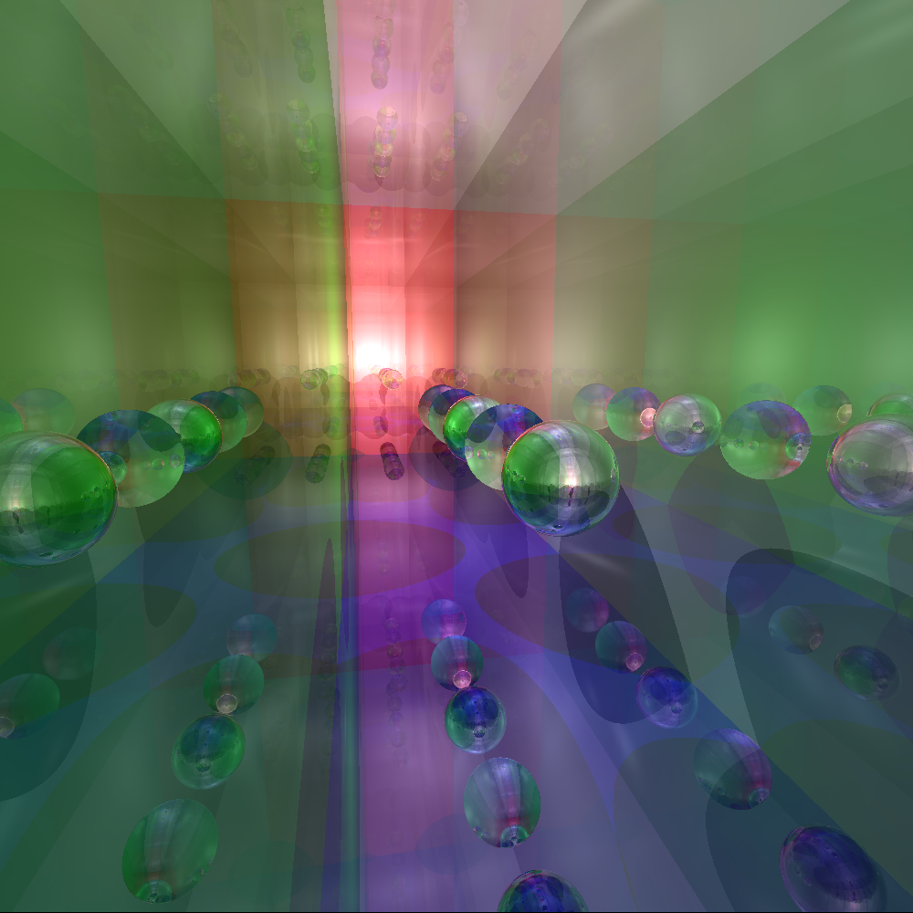
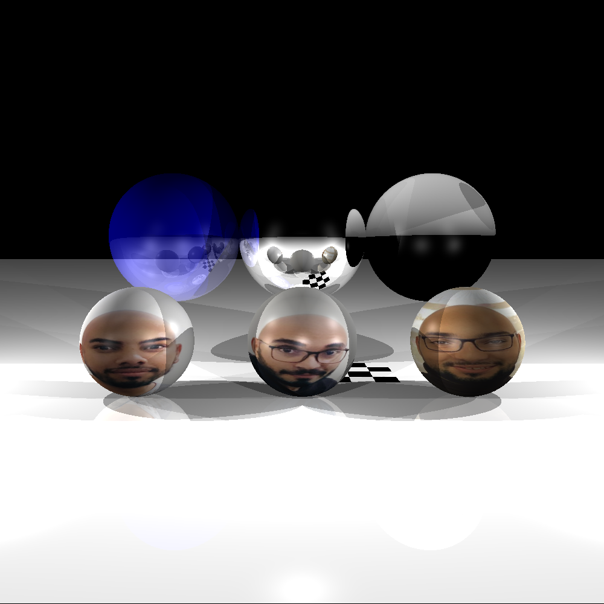

# RT
RT is an advanced rendering project of school 42. It implements Monte-Carlo Path Tracing algorithm, 
usesing Multi-threading to accelerate rendering
*Note:* this project was made for MacOS.


<!-- GETTING STARTED -->
## Getting Started

To get a local copy up and running follow these simple steps.

### Prerequisites

This is an example of how to list things you need to use the software and how to install them.
* Mac os
  ```sh
  mlx
  gcc
  cmake
  git
  ```

### Installation

1. Clone the repo
   ```sh
   git clone --recurse-submodules https://github.com/aitelkob/Rt.git
   ```
2. enter repository
   ```sh
   cd RT
   ```


<!-- USAGE EXAMPLES -->
## Usage

1. Make executable
   ```sh
   make
   ```
2. Execute
   ```sh
   ./RT [file_path].yml or .obj
   ```
3. Exit
   ```sh
   esc
   ```


See the [open issues](https://github.com/aitelkob/Rtv1/issues) for a list of proposed features (and known issues).


<!-- CONTRIBUTING -->
## Contributing

Contributions are what make the open source community such an amazing place to be learn, inspire, and create. Any contributions you make are **greatly appreciated**.

1. Fork the Project
2. Create your Feature Branch (`git checkout -b feature/AmazingFeature`)
3. Commit your Changes (`git commit -m 'Add some AmazingFeature'`)
4. Push to the Branch (`git push origin feature/AmazingFeature`)
5. Open a Pull Request


<!-- LICENSE -->
## License

Distributed under the MIT License. See `LICENSE` for more information.

**Program running:**
<table style="width:100%">
  <tr>
    <td></td>
    <td></td>
    <td></td>
  </tr>
<tr>
    <td></td>
    <td></td>
    <td></td>
  </tr>
  <tr>
    <td></td>
    <td></td>
    <td></td>
  </tr>
<tr>
    <td></td>
    <td></td>
    <td></td>
  </tr>
  <tr>
    <td></td>
    <td></td>
    <td></td>
  </tr>
<tr>
    <td></td>
    <td></td>
    <td></td>
  </tr>
</table>

<!-- CONTACT -->
## Contact

Your Name - [@twitter_handle](https://twitter.com/twitter_handle) - email

Project Link: [https://github.com/aitelkob/Rtv1](https://github.com/aitelkob/Rt)
